```mermaid
graph LR
    A["🌱 Forming<br/>Coming together<br/>Polite & uncertain<br/>Figuring out roles"] --> B["⛈️ Storming<br/>Conflict & confusion<br/>Processes break down<br/>Chaotic but necessary"] ~~~ C["🔧 Norming<br/>Establishing processes<br/>Resolving conflicts<br/>Building trust & clarity"] ~~~ D["🚀 Performing<br/>High team morale<br/>Smooth processes<br/>Peak productivity"]
    
    style A fill:transparent,stroke:#4caf50,stroke-width:3px
    style B fill:transparent,stroke:#f44336,stroke-width:3px
    style C fill:transparent,stroke:transparent,color:transparent
    style D fill:transparent,stroke:transparent,color:transparent
```

```mermaid
graph LR
    A["🌱 Forming<br/>Coming together<br/>Polite & uncertain<br/>Figuring out roles"] --> B["⛈️ Storming<br/>Conflict & confusion<br/>Processes break down<br/>Chaotic but necessary"]
    B --> C["🔧 Norming<br/>Establishing processes<br/>Resolving conflicts<br/>Building trust & clarity"] ~~~ D["🚀 Performing<br/>High team morale<br/>Smooth processes<br/>Peak productivity"]
    
    style A fill:transparent,stroke:#4caf50,stroke-width:3px
    style B fill:transparent,stroke:#f44336,stroke-width:3px
    style C fill:transparent,stroke:#2196f3,stroke-width:3px
    style D fill:transparent,stroke:transparent,color:transparent
```

# From Storming to Norming (and Beyond)

## Team Development & Process Improvements

<!--
PRESENTER NOTES:

Welcome everyone. Thank you for taking the time to be here today.

Today I want to talk about where we've been as a team, where we are now, and where we're going. This is going to be an honest conversation about our challenges and how we're addressing them together.

The goal is to:
1. Acknowledge the difficulties we've faced
2. Provide a framework for understanding team development
3. Share concrete process improvements we're implementing
4. Set expectations for our focus over the coming weeks

Let's get started.
-->

---
layout: two-cols-header

---

# Acknowledging Our Journey

::left::

We've been through a rough patch where our processes broke down

<v-clicks>

* Communication gaps

* Unclear expectations

* Rework and frustration

* Blurred accountability

</v-clicks>

<v-click>

**But this is a normal part of team development.**

**And we're going to take concrete steps to emerge stronger than before.**

</v-click>

::right::

<!--
PRESENTER NOTES:

I want to start by being direct and honest: we've had a rough time recently. Our processes haven't been working the way they should.

Let me be specific about what I mean:
- Communication gaps: Information hasn't been flowing smoothly between teams
- Unclear expectations: People weren't sure what was expected of them or when
- Rework and frustration: We've had to redo work, sometimes multiple times, which is demoralizing
- Blurred accountability: It wasn't always clear who was responsible for what decisions

[PAUSE after revealing the click]

But here's the important part: this is actually a normal part of team development. We're not broken. We're growing. And we're going to take concrete steps to come out of this stronger than before.
-->

---
layout: default

---

# Tuckman's Stages of Group Development

A framework for understanding team evolution

```mermaid
graph LR
    A["🌱 Forming<br/>Coming together<br/>Polite & uncertain<br/>Figuring out roles"] ~~~ B["⛈️ Storming<br/>Conflict & confusion<br/>Processes break down<br/>Chaotic but necessary"] ~~~ C["🔧 Norming<br/>Establishing processes<br/>Resolving conflicts<br/>Building trust & clarity"] ~~~ D["🚀 Performing<br/>High team morale<br/>Smooth processes<br/>Peak productivity"]
    
    style A fill:transparent,stroke:#4caf50,stroke-width:3px
    style B fill:transparent,stroke:transparent,color:transparent
    style C fill:transparent,stroke:transparent,color:transparent
    style D fill:transparent,stroke:transparent,color:transparent
```

= 4">

<v-click at="5">

☝️

```mermaid
graph LR
    A["🌱 Forming<br/>Coming together<br/>Polite & uncertain<br/>Figuring out roles"] --> B["⛈️ Storming<br/>Conflict & confusion<br/>Processes break down<br/>Chaotic but necessary"]
    B --> C["🔧 Norming<br/>Establishing processes<br/>Resolving conflicts<br/>Building trust & clarity"]
    C --> D["🚀 Performing<br/>High team morale<br/>Smooth processes<br/>Peak productivity"]
    
    style A fill:transparent,stroke:#4caf50,stroke-width:3px
    style B fill:transparent,stroke:#f44336,stroke-width:3px
    style C fill:transparent,stroke:#2196f3,stroke-width:3px
    style D fill:transparent,stroke:#ff9800,stroke-width:3px
```

**We are here:**

Transitioning from Storming → Norming

</v-click>

Note: Teams can cycle through stages when facing major changes (new members, new goals, process breakdowns)

<!--
PRESENTER NOTES:

To understand where we are, I want to introduce a framework developed by psychologist Bruce Tuckman in 1965. It's called Tuckman's Stages of Group Development, and it describes how teams naturally evolve over time.

There are four main stages:

1. FORMING - This is the honeymoon phase. The team comes together, everyone is polite, trying to figure out their role. There's excitement but also uncertainty.

2. STORMING - This is where things get real. Conflicts emerge. Processes break down. People push back against constraints. Feedback is ad-hoc. It sucks. It feels chaotic and uncomfortable. It's necessary for growth.

3. NORMING - The team starts to resolve conflicts and establish working agreements. Processes get defined, roles become clearer, trust starts to build. This is where we establish "how we work together."

4. PERFORMING - The team hits its stride. Processes are smooth, people know their roles, trust is high, morale is high, and productivity soars.

The key insight: EVERY successful team goes through these stages. Storming is part of growth.
-->

---
layout: two-cols-header

---

# Focus on norming

**We are going to spend the next several weeks focusing on norming**

::left::

* Healing and celebrating wins
* Establishing clear processes
* Defining roles and responsibilities
* Creating shared understanding
* Building sustainable workflows

::right::

<!--
PRESENTER NOTES:

So what does this mean practically?

For the next several weeks, our primary focus as a team needs to be on NORMING. This means:

1. Healing - acknowledging our journey, the challenges we've faced, and celebrating wins
2. Establishing clear processes - not bureaucracy, but shared agreements on how work flows
3. Defining roles and responsibilities - who makes which decisions, who needs to be consulted
4. Creating shared understanding - making sure we're all on the same page about how we work
5. Building sustainable workflows - processes that work for everyone and can scale

This is an investment. It might feel like it slows us down in the short term. But it's essential for us to become a high-performing team.

I'm going to show you one concrete example of how we're doing this.
-->

---
layout: center

---

# Process Improvement: Requirements & Design

One key area where we're already making progress

<!--
PRESENTER NOTES:

One of our biggest pain points has been around requirements and design. What's the process by which we take an idea and turn it into a working feature?

The dev team has been working on a structured approach to fix this. I want to walk you through the problem and the solution.
-->

---
layout: two-cols-header

---

# Problem statement

## Current State of requirement and design refinement

::left::

<v-clicks>

* Requests arrive as loosely defined "feature ideas"
* Missing problem statements, success criteria, UX research
* Piecemeal, ad-hoc feedback that sometimes contradicts earlier direction
* QA reopens design decisions instead of verifying requirements
* Unclear accountability and approval authority

</v-clicks>

<v-click>

**Result:** Churn, confusion, rework, frustration

This is a process failure, not the fault of any individual or team.

</v-click>

::right::

<!--
PRESENTER NOTES:

Let me be specific about the problem we've been experiencing:

[REVEAL EACH CLICK AS YOU DISCUSS]

1. Requests arrive as loosely defined "feature ideas" - not refined requirements with clear problem statements
2. They're missing success criteria and validation from actual UX research
3. Feedback comes in piecemeal and ad-hoc, sometimes contradicting what we heard earlier
4. By the time we get to QA, feedback sometimes reopens earlier design or scope decisions instead of just verifying what was agreed upon
5. It's not clear who has final authority to approve requirements or sign off on design readiness

[FINAL CLICK]

The result? Confusion, rework, and frustration for everyone involved. This isn't any individual's fault - it's a structural problem that needs a structural solution.
-->

---
layout: default

---

# The Solution: A Structured 5-Phase Process

* Clear inputs, outputs, and approvals at each stage
* Industry-standard framework (Design Council, UK) adapted with clear ownership & phase gates
* Also aligns with: Google UX Design Process, Lean UX, standard PRD → Engineering workflows

<!--
PRESENTER NOTES:

The solution is to create a structured process that separates discovery, design, and validation - and makes the inputs, outputs, and approvals explicit at each stage.

This process we're showing you here is adapted from an industry-standard Double Diamond design framework, which has four phases: Discover, Define, Design, and Deliver. Our process maps directly to this, with "Deliver" split into Build and Validate to make the engineering and QA phases explicit.

It also broadly aligns with Google's UX Design Process, Lean UX principles, and the standard PRD-to-Engineering workflows used in most SaaS organizations.

We're proposing a 5-phase process. Each phase has:
- A clear lead/owner
- A key question it answers
- Required inputs to start
- An approved output before moving to the next phase

Let me walk through each phase.
-->

---
layout: two-cols-header

---

# Phases 1 & 2: Discover and Define

::left::

## Phase 1: Discover

**Lead:** Partnerships (or Dev for technical initiatives)

**Key Question:** What is the user problem or goal?

**Required Input:**

* Documented user feedback/data
* Clear problem statement
* Rationale

**Output:**
Problem brief (solution-free) approved by leadership

::right::

## Phase 2: Define

**Lead:** D-Team*

**Key Question:** What does success look like?

**Required Input:**

* Problem brief
* Discussion notes

**Output:**
Requirements doc (user stories, acceptance criteria, metrics) approved by leadership.

*D-Team: We'll explain this structure in detail shortly.

<!--
PRESENTER NOTES:

PHASE 1 - DISCOVER:
This is typically led by Partnerships for user-facing features. The key question is: What is the user problem or goal?

However, Dev can also initiate projects—for example, technical work like backend migrations for scalability, security updates, or infrastructure improvements. In those cases, Dev leads the Discover phase.

Regardless of who leads, we need documented evidence: user feedback/data for partnership-led projects, or technical rationale and impact analysis for dev-initiated work. No more "wouldn't it be cool if..." - we need evidence of a real need.

The output is a problem brief that both Partnerships and Dev/Product leads approve. This ensures we're aligned on the problem before we start designing solutions.

PHASE 2 - DEFINE:
This is led by the D-Team - we'll explain what that means in a moment. The key question is: What does success look like?

We take the problem brief and work together to define requirements: user stories, acceptance criteria, and success metrics.

The output is a requirements document that both teams approve. This becomes THE CONTRACT for the work. Once approved, this is what we're building to.
-->

---
layout: two-cols-header

---

# Phases 3 & 4: Design and Build

::left::

## Phase 3: Design

**Lead:** D-Team*

**Key Question:** How should this work and look?

**Required Input:**

* Requirements doc
* Relevant constraints

**Output:**
Design spec (flows, components, accessibility) - shared for feedback, not unstructured redesign

*D-Team: We'll explain this structure in detail shortly.

::right::

## Phase 4: Build

**Lead:** Dev

**Key Question:** How do we implement this faithfully?

**Required Input:**

* Finalized design spec

**Output:**
Working feature in staging that matches spec

<!--
PRESENTER NOTES:

PHASE 3 - DESIGN:
This is led by the D-Team - again, we'll explain this structure shortly. The key question is: How should this work and look?

We take the requirements doc and any relevant constraints and create a design spec - flows, components, accessibility notes.

Important: we share this for feedback, but it's not subject to unstructured redesign. The requirements were already approved. This is about HOW we implement them.

PHASE 4 - BUILD:
This is led by Dev. The key question is: How do we implement this faithfully?

We take the finalized design spec and build it. The output is a working feature in staging that matches the spec.

Notice the pattern: each phase builds on the approved output of the previous phase. No going backwards.
-->

---
layout: default

---

# Phase 5: Validate (QA)

**Lead:** QA team

**Key Question:** Does it meet the approved requirements?

**Required Input:**

* Feature in staging
* Checklist

**Output:**
QA sign-off that requirements are met

<!--
PRESENTER NOTES:

PHASE 5 - VALIDATE (QA):
This is led by QA, with shared responsibility. The key question is: Does it meet the approved requirements?

We take the feature in staging and a checklist based on the requirements doc, and we verify that what was built matches what was agreed upon.

[REVEAL CLICK]

And this is crucial: QA is NOT a restart of the design process. We're not redesigning the feature at this stage. We're verifying that it meets the requirements that were already approved.

If there's a problem with the requirements themselves, that's a different conversation - but it means we need to go back and revise the requirements doc, not just give ad-hoc feedback.
-->

---
layout: default

---

## Another Source of Friction

<v-click>

### Problem: Who "owns" product and design?

* Ambiguity creates tension and duplicated effort
* "Design" means different things to different people
* No clear accountability for the Define and Design phases

</v-click>

<v-click>

### Solution: The D-Team

**The Product Definition and Design Team**: a cross-functional working group, formed on a per-project basis.
It is responsible for translating validated user needs into product solutions.

</v-click>

<v-click>

| Role | Source | Purpose |
|------|--------|---------|
| **UX & User Insight Lead** | Partnerships | Brings classroom/teacher/user needs & context |
| **Content/Pedagogy Expertise** | Research | Ensures validity and learning design |
| **Product Design Lead** | (Capacity Placeholder) | Translates needs into workflows, UI, and component usage |
| **Engineering Feasibility Lead** | Dev | Ensures technical viability early |

</v-click>

<v-click>

**Key principle:** Design is a role, not a department. Neither team "owns the product" unilaterally.

</v-click>

<!--
PRESENTER NOTES:

Before we move on, I want to address another source of friction that's been affecting our team.

[CLICK - THE PROBLEM]

The problem is ambiguity around ownership. Who "owns" product and design? This question has created real tension. We've had duplicated effort, unclear accountability, and the word "design" itself means different things to different people. Some think of it as visual design, others as user experience, others as product definition. This ambiguity has made the Define and Design phases challenging.

[CLICK - THE SOLUTION]

The solution is the D-Team - the Product Definition and Design Team. This is a cross-functional working group formed on a per project basis. It's not a new department. It's not something you apply for or get promoted into. It's a group of people from both teams who work together on defining and designing a solution.

[CLICK - THE TABLE]

Here's who's in it:

1. UX & User Insight Lead - from Partnerships. This person brings the classroom context, teacher needs, and user perspective.

2. Product & Interaction Design Lead - from the Dev Team. This person translates those needs into actual workflows, UI patterns, and component usage.

3. Engineering Feasibility Lead - also from Dev. This person ensures we're not designing something that's technically impossible or prohibitively expensive to build.

4. And optionally, Content or Pedagogy Expertise - from Partnerships or Research - when we're working on something that has significant learning design implications.

[CLICK - KEY PRINCIPLE]

The key principle here is: Design is a ROLE, not a department. Neither team owns "the product" unilaterally. We own it together, with clear roles and responsibilities.

This structure makes the Define and Design phases collaborative by default, while still having clear accountability. It answers the question "who owns product and design?" with: we all do, in specific ways.
-->

---
layout: default

---

# Summary: Two Solutions for Norming

## 1. Structured 5-Phase Process

<v-clicks>

* **Discover → Define → Design → Build → Validate**
* Each phase has clear inputs, outputs, and approvals
* Based on industry-standard Double Diamond framework
* Iteration within a phase is normal. Moving backward requires mutual director approval.

</v-clicks>

## 2. The D-Team

<v-clicks>

* **Cross-functional working group** (per-project)
* Owns Define and Design phases collaboratively
* Includes: UX Lead (Partnerships), Product/Interaction Lead (Dev), Engineering Feasibility (Dev)
* **Key principle:** Design is a function, not a department.

</v-clicks>

<v-click>

## What this gives us

* Shared accountability and clear ownership
* Protection from scope creep and rework
* Reduced friction and duplicated effort

</v-click>

<!--
PRESENTER NOTES:

Let me summarize what we've covered. We're proposing two interconnected solutions to help us move from storming to norming:

[CLICK - STRUCTURED PROCESS]

First, a structured 5-phase process: Discover, Define, Design, Build, Validate. This is based on the industry-standard Double Diamond framework. Each phase has clear inputs, outputs, and approvals. Once a phase is approved, we don't go backward - we move forward with confidence.

[CLICK - THE D-TEAM]

Second, the D-Team - a cross-functional working group formed on a per-project basis. This team owns the Define and Design phases collaboratively. It includes a UX Lead from Partnerships, a Product/Interaction Design Lead from Dev, and an Engineering Feasibility Lead from Dev. The key principle: Design is a role, not a department. No one team owns the product unilaterally.

[CLICK - WHAT THIS GIVES US]

Together, these solutions give us:

* Shared accountability with clear ownership
* Protection from scope creep and rework
* Reduced friction and duplicated effort
* A clear path to high-performing collaboration

This is how we norm. This is how we build the foundation for becoming a high-performing team.
-->

---
layout: default

---

# Norm to Perform

## This is our investment in becoming a high-performing team

## Norming

  

## Performing

  

<!--
PRESENTER NOTES:

So what happens next?

[REVEAL EACH CLICK]

1. We're going to implement and refine this requirements process. It won't be perfect at first - we'll learn and adjust.

2. We'll continue identifying other process gaps. Requirements and design is one area, but there are others we need to address.

3. We'll build shared understanding and trust. This takes time and consistent effort from everyone.

4. We'll establish sustainable team rhythms - ways of working that we can maintain long-term.

[FINAL CLICK]

This is our investment in becoming a high-performing team. We're choosing to spend time on norming now so that we can perform at a high level later.

This is the path from where we are to where we want to be.
-->
